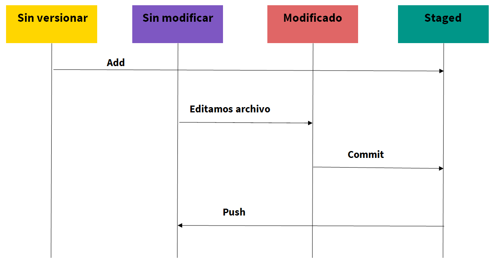

## Lección 1 - Conceptos básicos de Git

### Primer paso: ¿Qué es versionar código?

* El versionado almacena todas las modificaciones realizadas en el código.
* Permite acceder a versiones anteriores de cualquier archivo.
* Garantiza el trabajo en equipo de manera eficiente.
* Acciones útiles: regresar a una versión anterior de tu proyecto, comparar cambios, ver quien realizó y para que una modificación, recuperar archivos perdidos…. Y MUCHO MAS ! 


### ¿Cómo empezamos?

Opciones:

* Creamos un repositorio local y luego lo publicamos en el servidor remoto
* Creamos el repositorio en el servidor remoto y luego lo descargamos en nuestro directorio local.
* Bajamos un repositorio existente desde el servidor remoto, mediante el comando:  `git clone <remote>`

### Comandos básicos: 

#### Add

**Sinopsis :** `git add`

**Descripción:**
Agrega el archivo o directorio al Staging Area.

**Opciones:**

``` 
  git add <file-path>
  git add -all
  git add -u
  git add .
```

#### Commit

**Sinopsis:** `git commit` 

**Descripción:**  
Agrega/guarda los cambios al repositorio local.

**Opciones:** 

``` 
  git commit -m “Primer commit”
  git commit -am “Primer commit”
  git revert “hash_commit”
```  
#### Pull

**Sinopsis:** `git pull`

**Descripción:** 
Actualiza el repositorio local con el repositorio remoto.

**Opciones:** 
```
  git pull <remote>
```

#### Push

**Sinopsis:** `git push`

**Descripción:** 
Envía los cambios desde el repositorio local al repositorio remoto.

**Opciones:** 
```
  git push 
  git push -- force
```

#### Ciclo de vida de los archivos mediante Git



El esquema muestra el ciclo de vida de los archivos mediante Git. El primer cuadro representa el estado _“Sin versionar”_, hay un segundo cuadro que simboliza el estado _“Sin modificar”_, un tercer cuadro que muestra el estado _“Modificado”_ y por último un cuadro que representa el estado _"Staged"_. Entre los estados/cuadros hay flechas que simbolizan el cambio de estado. 

Entre el cuadro _“Sin versionar”_ y el cuadro _“Staged”_ hay una flecha que se llama _Add_. Entre el cuadro _“Sin modificar”_ y el cuadro _“Modificado”_ hay una flecha que se llama _“Editamos archivo”_. Entre el cuadro _“Modificado”_ y _“Staged”_ hay una flecha que se llama _“Commit”_. Por último entre el cuadro _“Staged”_ y el cuadro _“Sin modificar”_ hay una flecha que se llama _“Push”_.

### Para tener en cuenta :)

* Ejecutar _pull_ antes de hacer un _push_.

* Quedarnos tranquilxs que Git gestiona los conflictos.

* Siempre se puede volver a una versión anterior, solucionar, romper y volver a solucionar :)

### ¿Qué software necesitamos?

Para poder realizar todos los comandos que vimos antes, tenemos que tener instalados los siguientes softwares:

* Última versión de R: https://cloud.r-project.org/
* Útima versión preview de RStudio: https://www.rstudio.com/products/rstudio/download/preview/

#### Git

* Git para Windows: https://gitforwindows.org/
* Git para macOS: http://git-scm.com/downloads 
* Git para Linux: 
  - Ubuntu o Debian Linux:  sudo apt-get install git
  - Fedora o RedHat Linux: sudo yum install git

#### Clientes de Git:

* GitKraken: https://www.gitkraken.com/

* GitHub Desktop: https://desktop.github.com/ 

* Github: https://github.com/ 

Este es un listado de guías sobre Git para que puedan incursionar mas en detalle sobre los comandos de git y los diferentes estados de un archivo: 

* https://book.git-scm.com/
* https://www.atlassian.com/es/git/tutorials/learn-git-with-bitbucket-cloud
* http://marklodato.github.io/visual-git-guide/index-en.html